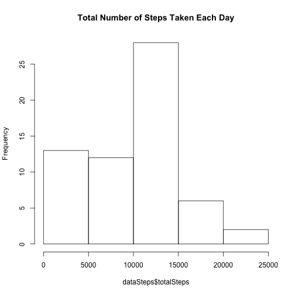
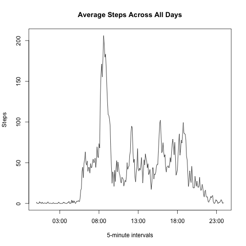
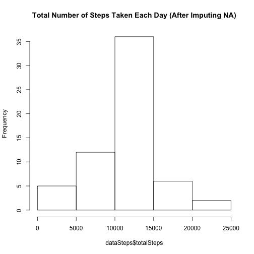
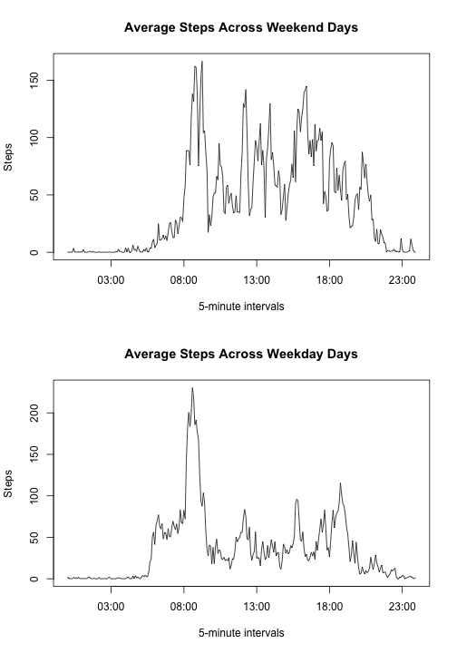

Github repository: https://github.com/ckghosted/RepData_PeerAssessment1

## Introduction
This assignment makes use of data from a personal activity monitoring device. This device collects data at 5 minute intervals through out the day. The data consists of two months of data from an anonymous individual collected during the months of October and November, 2012 and include the number of steps taken in 5 minute intervals each day.  

First of all, set some global options:

```r
library(knitr)
opts_chunk$set(echo = TRUE, results = "hide")
options(digits = 2)
```

## Loading and preprocessing the data
The *activity.zip* file should be included in the Github repository.

```r
if(!file.exists("activity.csv")) unzip("activity.zip")
data = read.csv("activity.csv")
```

## What is mean total number of steps taken per day?
Here, we ignore the missing values in the dataset.  

1. Calculate the total number of steps taken per day.

```r
library(dplyr, warn.conflicts = FALSE)
dataByDate = group_by(data, date)
dataSteps = summarize(dataByDate,
                      totalSteps = sum(steps, na.rm = TRUE))
```

2. Make a histogram of the total number of steps taken each day.

```r
hist(dataSteps$totalSteps, main = "Total Number of Steps Taken Each Day")
```

 

3. Calculate and report the mean and median of the total number of steps taken per day.

```r
totalStepsMean = mean(dataSteps$totalSteps)
totalStepsMedian = median(dataSteps$totalSteps)
```
The mean of the total number of steps taken per day is: 9354.23;  
The median of the total number of steps taken per day is: 10395.

## What is the average daily activity pattern?
1. Make a time series plot (i.e. type = "l") of the 5-minute interval (x-axis) and the average number of steps taken, averaged across all days (y-axis).

```r
dataByInterval = group_by(data, interval)
dataIntervals = summarize(dataByInterval,
                          stepAverage = mean(steps, na.rm = TRUE))
dataIntervals = mutate(dataIntervals,
                       hourMinute = paste(as.character(floor(interval/100)),
                                          as.character(interval%%100)))
with(dataIntervals,
     plot(strptime(hourMinute, "%H %M"),
          stepAverage,
          type = "l",
          xlab = "5-minute intervals",
          ylab = "Steps",
          main = "Average Steps Across All Days"))
```

 

2. Which 5-minute interval, on average across all the days in the dataset, contains the maximum number of steps?

```r
maxSteps = max(dataIntervals$stepAverage)
maxStepInterval = dataIntervals$hourMinute[which.max(dataIntervals$stepAverage)]
maxStepHM = format(strptime(maxStepInterval, "%H %M"), "%H:%M")
```
The 5-minute interval around 08:35 contains the maximum number of steps: 206.17.

## Imputing missing values
Now consider the missing values.  

1. Calculate and report the total number of missing values in the dataset (i.e. the total number of rows with NAs).

```r
numNA = sum(is.na(data$steps))
```
The total number of missing values in the dataset is 2304.

2. Fill in all of the missing values in the dataset using the mean for that 5-minute interval from previous results (data.frame *dataIntervals*). Note that the indeces used to access *dataIntervals* should be set to 1, 2, ..., and 288.

```r
for (i in 1:nrow(data)) {
    if (is.na(data$steps[i])) {
        data$steps[i] = dataIntervals$stepAverage[(i - 1) %% 288 + 1]
    }
}
```

3. Make a histogram of the total number of steps taken each day.

```r
dataByDate = group_by(data, date)
dataSteps = summarize(dataByDate,
                      totalSteps = sum(steps, na.rm = TRUE))
hist(dataSteps$totalSteps, main = "Total Number of Steps Taken Each Day (After Imputing NA)")
```

 

4. Calculate and report the mean and median total number of steps taken per day. Do these values differ from the estimates from the first part of the assignment? What is the impact of imputing missing data on the estimates of the total daily number of steps?

```r
totalStepsMean = mean(dataSteps$totalSteps)
totalStepsMedian = median(dataSteps$totalSteps)
```
The mean of the total number of steps taken per day is: 1.08 &times; 10<sup>4</sup>;  
The median of the total number of steps taken per day is: 1.08 &times; 10<sup>4</sup>.  
These values differ from the estimates from the first part of the assignment. Some obsrvations follow:  

> 1. In the original raw data, there are 8 days in which all the "steps" records are missing. Hence, after filling missing values, the "total steps per day" in these 8 days should be all the same.  
> 2. Since I use the mean for each 5-minute interval to fill all missing values, the same "total steps per day" in these 8 days must equal to the average of "total steps per day", that is, 1.08 &times; 10<sup>4</sup>. Furthermore, this value will easily become the median since there are 8 such "total steps per day" that equal to the mean.  
> 3. By 1. and 2., it comes with no surprise that the mean equals to the median.  

## Are there differences in activity patterns between weekdays and weekends?
1. Create a new factor variable in the dataset with two levels – "weekday" and "weekend" indicating whether a given date is a weekday or weekend day.

```r
Sys.setlocale("LC_TIME", "C")
data = mutate(data,
              weekend = as.factor(weekdays(strptime(data$date, "%Y-%m-%d")) %in% c("Saturday", "Sunday")))
Sys.setlocale()
```

2. Make a panel plot containing a time series plot (i.e. type = "l") of the 5-minute interval (x-axis) and the average number of steps taken, averaged across all weekday days or weekend days (y-axis).

```r
dataByIntAndWeek = group_by(data, interval, weekend)
dataIntervals = summarize(dataByIntAndWeek,
                          stepAverage = mean(steps, na.rm = TRUE))
dataIntervals = mutate(dataIntervals,
                       hourMinute = paste(as.character(floor(interval/100)),
                                          as.character(interval%%100)))
dataIntWeekend = dataIntervals[dataIntervals$weekend == TRUE,]
dataIntWeekday = dataIntervals[dataIntervals$weekend == FALSE,]
par(mfrow = c(2, 1))
with(dataIntWeekend,
     plot(strptime(hourMinute, "%H %M"),
          stepAverage,
          type = "l",
          xlab = "5-minute intervals",
          ylab = "Steps",
          main = "Average Steps Across Weekend Days"))
with(dataIntWeekday,
     plot(strptime(hourMinute, "%H %M"),
          stepAverage,
          type = "l",
          xlab = "5-minute intervals",
          ylab = "Steps",
          main = "Average Steps Across Weekday Days"))
```

 

